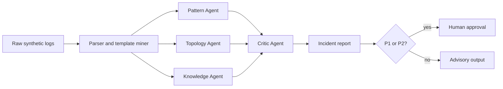

# Telecom Log Agent

[](https://github.com/ZhengjunSun/telecom-log-agent/actions/workflows/ci.yml)
[](https://www.python.org/)
[](LICENSE)

An auditable multi-agent workflow for telecom incident triage. It turns raw logs into a
timeline, probable root cause, evidence-backed findings, and approval-gated actions.

> Portfolio reconstruction by **SunZhengjun**. This repository uses synthetic data and
> independently written code. It contains no source code, logs, configuration, customer
> information, or proprietary knowledge from any former employer or client.

## Why this project

Production AIOps needs more than a chat interface. It needs deterministic preprocessing,
specialized analysis roles, evidence provenance, safe escalation, and repeatable evaluation.
This repository demonstrates those engineering boundaries while remaining runnable without
an API key.



## Highlights

- Four-agent workflow: pattern, topology, knowledge, and evidence critic
- Drain-inspired normalization of volatile log fields
- Evidence and confidence attached to every finding
- Human approval required before high-severity remediation
- FastAPI endpoint, CLI, Docker image, tests, and GitHub Actions
- Provider-neutral core: deterministic agents can later be replaced with an LLM

## Quick start

```bash
python -m venv .venv
# Windows: .venv\Scripts\activate
pip install -e ".[dev]"
telecom-log-agent examples/synthetic_incident.log
pytest -q
```

Run the API:

```bash
pip install -e ".[api]"
uvicorn telecom_log_agent.api:app --reload
```

## Design choices

The demo deliberately separates orchestration from model calls. That makes incident
classification testable, permits local/private model deployment, and prevents an LLM from
directly executing network changes. A production implementation would add streaming ingestion,
topology inventory, retrieval over approved runbooks, OpenTelemetry traces, RBAC, and replay-based
evaluation.

## Prior art

The architecture is informed by the public ideas behind
[Drain3](https://github.com/logpai/Drain3),
[Loglizer](https://github.com/logpai/loglizer), and
[LangGraph](https://github.com/langchain-ai/langgraph). No source code was copied from those
projects. See their repositories for their respective licenses.

## Safety and scope

All identifiers and events are fictional. The generated actions are advisory. This project must
not be connected to a live telecom network without authentication, authorization, change control,
and human review.

## License

MIT
