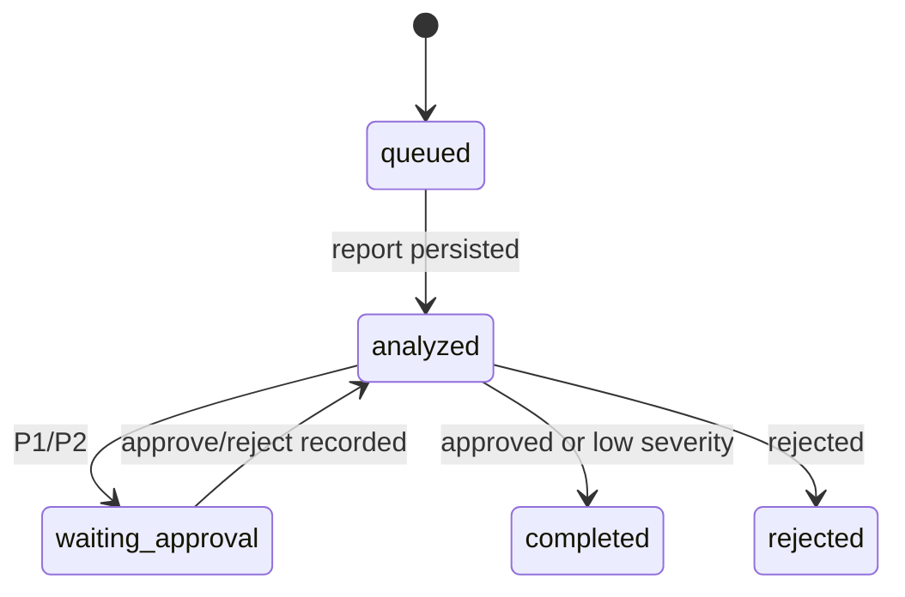

# Failure recovery and approval evidence

`ReplayStore` persists raw input, the generated report, lifecycle state, approval decision, analysis
run count, and an append-only event trail in SQLite. The runner can be reconstructed with the same
database after a process interruption.



The recovery test injects an interruption immediately after the report is persisted. A new runner
loads that report, requests approval, and completes only after an identified reviewer approves it.
The test asserts `analysis_runs == 1`, so recovery does not repeat analysis.

```bash
pytest -q tests/test_replay.py
```

Manual replay:

```bash
telecom-replay --db replay.db start examples/synthetic_incident.log
telecom-replay --db replay.db decide REPLAY-... approve --reviewer operator@example.test
telecom-replay --db replay.db events REPLAY-...
```

## Boundary

This provides single-process crash recovery for the deterministic analysis result. It does not
claim distributed consensus or exactly-once execution of external network operations. The project
never performs a network-changing action; recommendations remain advisory.
